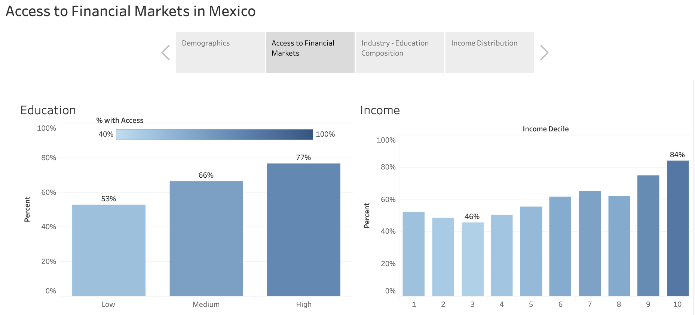

# Access to Financial Markets
### Task
This project studies a key question in emerging economies: how do households differ in their access to financial markets?
I study this using household data from Mexico.

### Data
Household data from [Mexican Family Life Survey](http://www.ennvih-mxfls.org/english/)

### Findings
- Access to financial markets increases with income and education, and varies significantly with industry and location.
- Younger households have higher education levels than older households.
- Access to financial markets varies significantly with location, even when controlling for education and income.

### Notebooks

| Notebook                                                                 | Description                                           |
| ------------------------------------------------------------------------ | ----------------------------------------------------- |
| [Clean Household Data](./notebooks/2005/01_clean_household_2005.ipynb)   | Clean household level data                            |
| [Clean Individual Data](./notebooks/2005/01_clean_individual_2005.ipynb) | Clean individual level data                           |
| [Merge Data](./notebooks/2005/02_merge_household_individual_2005.ipynb)  | Merge household and individual level data             |
| [EDA](./notebooks/2005/03_EDA.ipynb)                                     | Exploratory data analysis                             |
| [Financial](./notebooks/2005/03_financial.ipynb)                        | Study the determinants of access to financial markets |

### [Tableau Dashboard](https://public.tableau.com/app/profile/mitchell.vaughn4481/viz/AccesstoFinancialMarkets_17064813522530/AccesstoFinancialMarketsinMexico)

### Data Wrangling
- Imputed missing income values using multivariate regression.
- Merged individual level and household level datasets.
- Removed income outliers.

### Tools
- Pandas - data wrangling
- Matplotlib/seaborn - visualization
- Statsmodels - logistic regression
- Tableau - visualization
